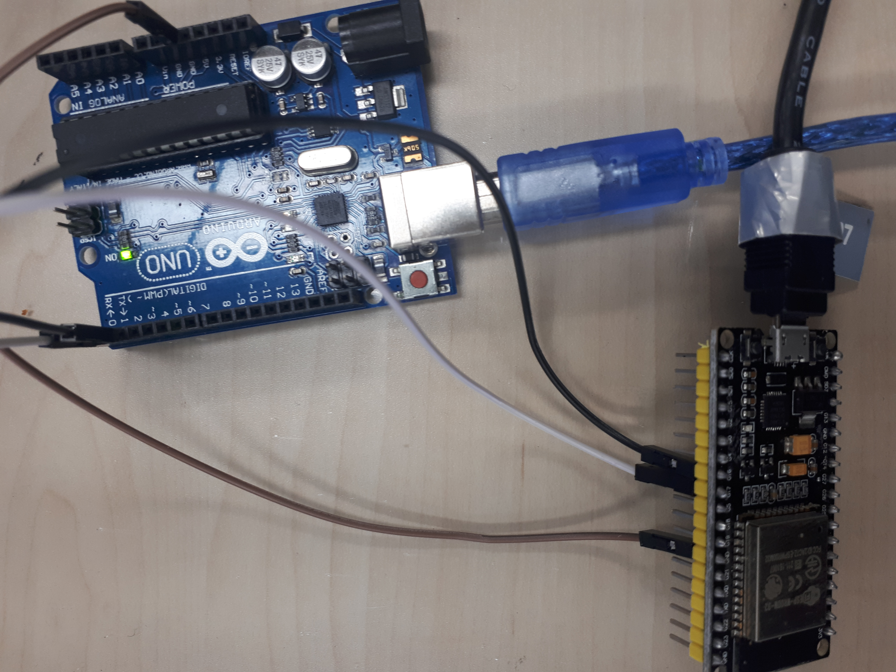
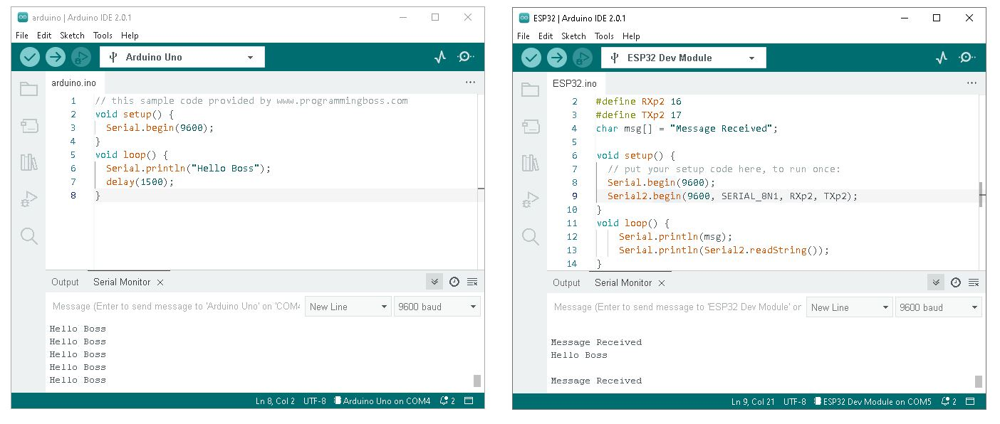

## Setup Notes

- Tutorial [Link](https://www.programmingboss.com/2021/04/esp32-arduino-serial-communication-with-code.html)
- Boards: Arduino UNO R3, ESP-WROOM-32
- Connect TX and RX of boards in a cross way. Also, connect GND pins of them. In ESP, we defined Pin #16 as RX and Pin #17 as TX. In Arduino, we used TX and RX defined on the board (Pin #1 and Pin #0).
- Provide two .ino files, one for ESP and one for Arduino.
- Ensure that the "serial baud rate" of both codes is the same (here 9600). Using different baud rates can result in receiving weird characters in the Serial Monitor of Arduino IDE.
- For the ESP code, download the ESP32 board on the IDE. This [link](https://randomnerdtutorials.com/installing-esp32-arduino-ide-2-0/) can help.
- One problem that may occur is that Arduino IDE may not recognize the ESP32 port. If it happens, first check if the USB cable can transfer data (it must be able to transfer data). If the cable has no problem, then it may be due to the USB-to-UART bridge driver. First, check the version required for the ESP board (must be written on a tiny black material on the board like [here](https://startingelectronics.org/articles/ESP32-WROOM-testing/)) and download it. For me, it was the cp2102 version. If you are using Windows 10 or 11, most probably the problem is because of the cable (It was also my problem).


## Connections


## ESP32 code

```
// this sample code provided by www.programmingboss.com
#define RXp2 16
#define TXp2 17
char msg[] = "Message Received";

void setup() {
  // put your setup code here, to run once:
  Serial.begin(9600);
  Serial2.begin(9600, SERIAL_8N1, RXp2, TXp2);
}
void loop() {
    Serial.println(msg);
    Serial.println(Serial2.readString());
}
```

## Arduino code

```
// this sample code provided by www.programmingboss.com
void setup() {
  Serial.begin(9600);
}
void loop() {
  Serial.println("Hello Boss");
  delay(1500);
}
```

## Result



