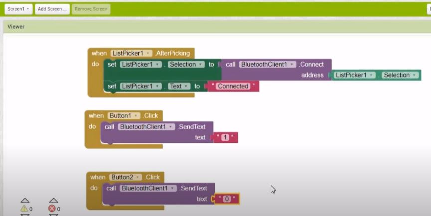
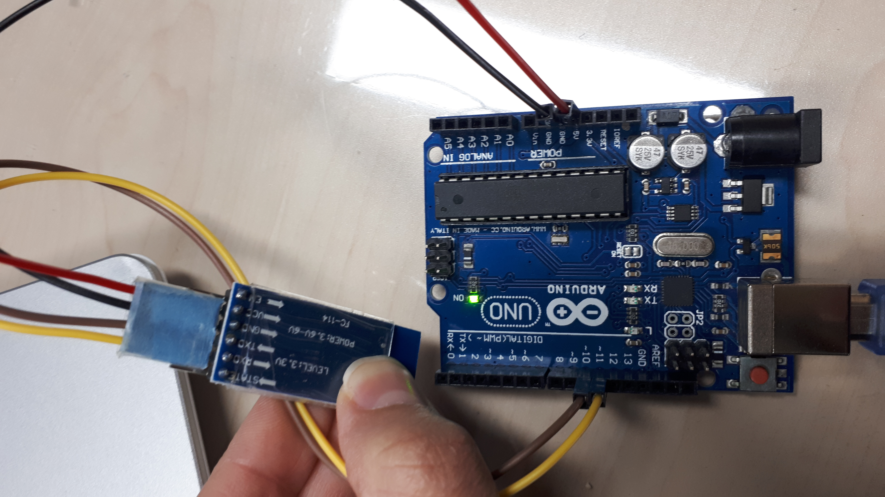

# Step 1

In this section, we attempted to send data to an Arduino from a mobile app over Bluetooth to check if the Bluetooth module works properly. We used the HC-05 Bluetooth module and Arduino UNO. Additionally, using [MIT App Inventor](http://ai2.appinventor.mit.edu/), we created a simple LED ON/OFF app to control an LED.

## Notes
- The tutorial we used can be found [HERE](https://www.youtube.com/watch?v=aQcJ4uHdQEA).
- To upload the compiled code correctly to the Arduino, HC-05 must be disconnected from Arduino.
- Download the app from [HERE](step1-HC05-connection-to-phone-bluetooth/Bluetooth.apk).

## Arduino Code

```
char Incoming_value = 0;
                
void setup() 
{
  Serial.begin(9600);         
  pinMode(13, OUTPUT);       
}

void loop()
{
  if(Serial.available() > 0)  
  {
    Incoming_value = Serial.read();      
    Serial.print(Incoming_value);        
    Serial.print("\n");        
    if(Incoming_value == '1'){
      Serial.println("1");             
      digitalWrite(13, HIGH);
    } 
    if(Incoming_value == '0'){
      Serial.println("0");       
      digitalWrite(13, LOW);
    }  
  }                            
}
```

## App Design


## Connections


## Demo


# Step 2

In this section, we attempted to transfer data from Arduino to Unity using Bluetooth (HC05). In the Arduino loop(), we transmitted '1' or '2' at one-second intervals. Subsequently, in Unity, we adjusted the ball color according to the received values.

## Notes
- First, pair HC-05 with your PC's Bluetooth. Then, in your PC's Bluetooth settings, identify the COM port to which HC-05 is connected (the Outgoing port).
- Ensure that in the Player settings, the API Compatibility level is set to ".NET" version 4 (It may be mentioned as .NET Framework) and not the standard version.
- To upload the compiled code to Arduino, first disconnect the HC-05, and after uploading, reconnect it.


## Connections


## C# Script

```
using System.Collections;
using System.Collections.Generic;
using UnityEngine;
using System.IO.Ports;
using System;

public class SerialCOM : MonoBehaviour
{
    // parameters
    private string port = "COM4";
    private int baudrate = 9600;

    private SerialPort sp;
    bool isStreaming = false;
    public GameObject sphere;


    // Start is called before the first frame update
    void Start()
    {
        Open();

    }

    // Update is called once per frame
    void Update()
    {
        if (isStreaming)
        {
            string value = ReadSerialPort();

            if (value != null)
            {   
                Debug.Log(value);


                if (value.Equals("1"))
                {
                    // change ball color to blue
                    print("blue");
                    sphere.GetComponent<Renderer>().material.color = Color.blue;

                }
                else if (value.Equals("2"))
                {
                    // change ball color to red
                    print("red");
                    sphere.GetComponent<Renderer>().material.color = Color.red;

                }
                else
                {
                    print(value + " Not Numeric!!!");
                }
            }
            else
            {
                print("Null Value!!!!!!");
            }


        }
    }


    public void Open()
    {
        isStreaming = true;
        sp = new SerialPort(port, baudrate);
        sp.ReadTimeout = 100;
        sp.Open();
        Debug.Log("Port was opened successfully");

    }

    public string ReadSerialPort(int timeout = 50)
    {
        string message;
        sp.ReadTimeout = timeout;
        try
        {
            message = sp.ReadLine();
            Debug.Log(message);
            return message;
        }
        catch (TimeoutException)
        {
            return null;
        }
    }

    public void Close()
    {
        sp.Close();
    }
}


```

## Arduino Code

```
#include <SoftwareSerial.h>;
SoftwareSerial myConn(10,11); //rx,tx

void setup(){

  myConn.begin(9600);
}

void loop(){

  myConn.println({"1"});
  delay(1000);
  myConn.println({"2"});
  delay(1000);

} 
```

## Demo


# Step 3

In this step, we attempted to control an LED from the Unity MRTK project. We incorporated two ON/OFF buttons from the Mixed Reality Toolbox (ensure you install the Mixed Reality Toolbox when adding MRTK to your project). Initially, we needed to pair HC-05 with the PC Bluetooth (refer to Step 2 for more details).

In "led.cs," we used only COM4 port, which we knew HC05 is connected to. However, in Hololens, we could not determine the port name. So, instead of using "led_all_ports.cs," we checked all the ports and attempted to send data to all of them, but it was unsuccessful.

## Notes
- In Unity, create a controller (and drag led.cs into it). After creating an MRTK button (from Mixed Reality -> toolkit -> toolbox), go to the "Inspector window -> Interactable script -> Events section -> Onclick()" and select the controller. Then, choose the appropriate method (for example, on_led()).
- [This](https://www.youtube.com/watch?v=EIpxXodmO6A) video can assist in creating MRTK Buttons.

## C# Script

 ```
// led.cs

using System.Collections;
using System.Collections.Generic;
using UnityEngine;
using System.IO.Ports;


public class led : MonoBehaviour
{
    // Start is called before the first frame update

    public SerialPort serial;
    private bool lightstate;

    void Start()
    {
        serial = new SerialPort("COM4", 9600);
        lightstate = false;

    }

    // Update is called once per frame
    public void on_led()
    {
        if(serial.IsOpen == false)
        {
            serial.Open();
        }
        serial.Write("A");
        lightstate = true;
    }

    public void off_led()
    {
        if (serial.IsOpen == false)
        {
            serial.Open();
        }
        serial.Write("B");
        lightstate = false;
    }
}


```


```
// led_all_ports.cs


using System.Collections;
using System.Collections.Generic;
using UnityEngine;
using System.IO.Ports;
using System;

public class led1 : MonoBehaviour
{
    // Start is called before the first frame update

    public SerialPort[] serials;
    private bool lightstate;

    void Start()
    {
        lightstate = false;
        string[] ports = SerialPort.GetPortNames();
        serials = new SerialPort[ports.Length];

        int i = 0;
        foreach (string port in ports)
        {
            serials[i] = new SerialPort(port, 9600);
            i++;
        }


    }

    // Update is called once per frame
    public void on_led1()
    {
        for (int i = 0; i < serials.Length; i++)
        {
            try
            {
                if (!serials[i].IsOpen)
                {
                    serials[i].Open();
                }
                serials[i].Write("A");
                lightstate = true;
                print("Successful");
                print(serials[i].PortName);
            }
            catch (Exception e)
            {
                print("Unsuccessful");
                print(serials[i].PortName);
            }
        }
    }

    public void off_led1()
    {

        for (int i = 0; i < serials.Length; i++)
        {
            try
            {
                if (!serials[i].IsOpen)
                {
                    serials[i].Open();
                }
                serials[i].Write("B");
                lightstate = false;
                print("Successful");
                print(serials[i].PortName);
            }
            catch (Exception e)
            {
                print("Unsuccessful");
                print(serials[i].PortName);

            }
        }
    }
}

```

## Arduino Code

```
// Control_Arduino_with_Unity.ino

int data;
#include <SoftwareSerial.h>;
SoftwareSerial myConn(10,11); //rx,tx

void setup(){
    myConn.begin(9600);
  pinMode(13,OUTPUT);
}
void loop(){
  if(myConn.available()){
    data = myConn.read();
    if(data == 'A'){
      digitalWrite(13,HIGH);
    }
    else {
      digitalWrite(13,LOW);
    }
  }
}

```

## Demo


